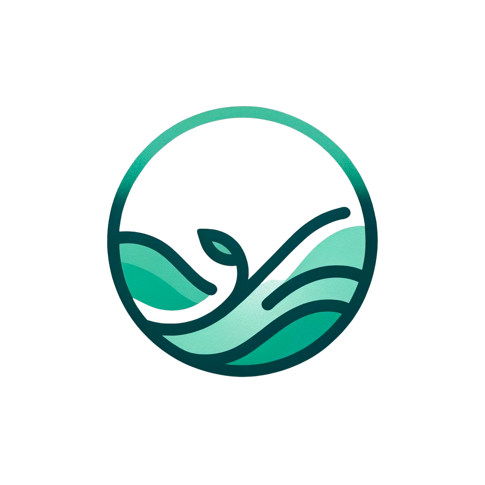

# WEALTHWAVE APPLICATION 

## WealthWave App Frontend 



**WealthWave** empowers you to take control of your finances and achieve your financial goals. 

Our platform provides a comprehensive suite of tools and resources to simplify your financial journey. Manage your finances with intuitive budgeting tools. Take control of your finances with our built-in budgeting tools that make tracking income, expenses, and savings goals effortless. Gain valuable insights and make informed financial decisions by exploring our library of financial wellness articles covering topics like saving strategies and investment tips. Need instant guidance? Our interactive chatbox is available 24/7 to provide personalized tips on budgeting, saving, and more. With WealthWave, you have the tools, knowledge, and support you need to achieve financial stability and reach your financial goals.

## Authors

- [@crimosq](https://github.com/crimosq)
- [@florla](https://github.com/florla)
- [@vbenavi0](https://github.com/vbenavi0)
- [@Lara-Crofts](https://github.com/Lara-Crofts)


## Technologies Used

- **React.js:** Frontend framework for building user interfaces.
- **Materialize:** CSS framework for responsive design.
- **Chart.js:** Library for data visualization with use of built-in chart types


# Run Locally


This guide will help you set up the repository on your local machine. Please follow these steps carefully to ensure a smooth setup process.
Clone the front end project with the following commands:


```bash
 git clone https://github.com/florla/capstone1.git
```
Navigate to the project directory for frontend 

```bash
 cd /frontend
```


Install dependencies


```bash
 npm install
```


Start the server


```bash
 npm start 
```


# WealthWave App Backend

## Tech Stack

**Server:** Node, Express

## Perquisites 
Node.js - [Download & Install Node.js](https://nodejs.org/en/download/) and the npm package manager. If you encounter any problems, you can also use this GitHub Gist to install Node.js.

## Environment Variables

To run this project, you will need to add the following environment variables to your .env file:

 You will need your own APIKEY from OpenAI. 
Linked are [Documents](https://www.maisieai.com/help/how-to-get-an-openai-api-key-for-chatgpt
) for obtaining a `APIKEY` key. 


You will also need your own `APIKEY` from **NewsAPI:** [NewsAPI](https://newsapi.org/). 
You can obtain a key linked here: 
[Documents](https://www.educative.io/answers/how-to-get-the-api-key-of-newsapi)


## Run Locally

Go to the project directory

```bash
  cd /backend
```

Install dependencies

```bash
  npm install
```
Create .env file (to insert and API keys)
```bash
  touch .env
```
Input your APIKEY inside .env 
```bash
OPENAI_API_KEY="YOUR_APIKEY"

NEWS_API_KEY=NEWS_APIKEY

```
Start the server

```bash
  npm run start 

  or node server.js
```


## API Reference

This section details the WealthWave backend API's endpoints, functionalities, authentication requirements, and response formats. 

### Base URL:

http://localhost:5000 (for local development)
Replace with your actual deployment URL in production

### News API Integration:

WealthWave leverages the NewsAPI (https://newsapi.org/) to fetch financial news articles based on user queries.
A valid News API key is required to access these endpoints.

### Available Endpoints:

Get Articles (/api/articles):

Method: GET

Parameters/Category (query string) available: 

| Parameters | 
| :-------- | 
| `financial literacy education` | 
| `financial budgeting` | 
| `emergency savings` | 
| `credit card finance` | 


### Response: 
JSON object containing a list of fetched news articles
Example Request (all categories):

``` http://localhost:5000/api/articles ```


### Example Request (articles for financial education and wellness):

 ``` http://localhost:5000/api/articles?category=financial%20education%20wellness ```
